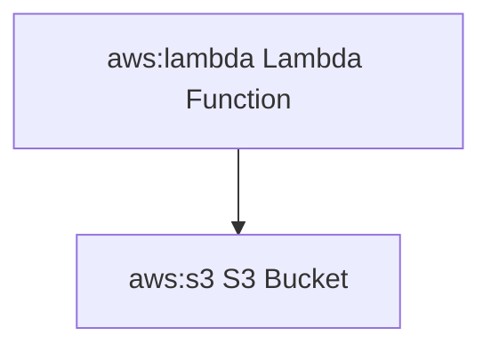

# Mermaid AWS Icons

A collection of AWS icons for use with Mermaid.js diagrams.

## Installation

```bash
npm install @valravnx/aws-icons
```

## Usage

```javascript
import mermaid from 'mermaid';
import { icons } from '@valravnx/aws-icons';

// Register the AWS icon pack
mermaid.registerIconPacks([
  {
    name: 'aws',
    icons,
  },
]);
```

Then in your Mermaid diagrams:



## Available Icons

All AWS service icons are available with the prefix `aws:`. For example:
- aws:lambda
- aws:s3
- aws:ec2
- aws:dynamodb

## License

This project is licensed under the MIT License. AWS icons are trademarks of Amazon Web Services, Inc.
