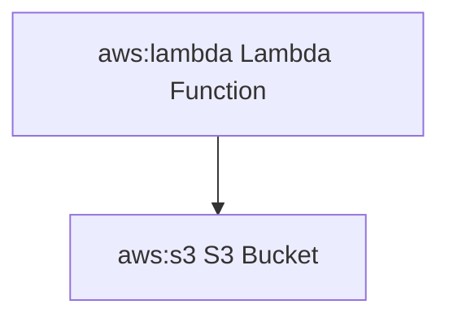

# Mermaid AWS Icons

A collection of AWS icons for use with Mermaid.js diagrams.

## Installation

```bash
npm install @codiva/aws-icons
```

## Usage

```javascript
import mermaid from 'mermaid';
import { icons } from '@codiva/aws-icons';

// Register the AWS icon pack
mermaid.registerIconPacks([
  {
    name: 'aws',
    icons,
  },
]);
```

Then in your Mermaid diagrams:



## Available Icons

All AWS service icons are available with the prefix `aws:`. For example, to use the Lambda icon, you would write `aws:lambda`.

Here's a complete list of available icons organized by category:

### Analytics
- aws:analytics-athena - Amazon Athena
- aws:analytics-clean-rooms - AWS Clean Rooms
- aws:analytics-cloudsearch - Amazon CloudSearch
- aws:analytics-data-exchange - AWS Data Exchange
- aws:analytics-data-pipeline - AWS Data Pipeline
- aws:analytics-datazone - AWS DataZone
- aws:analytics-emr - Amazon EMR
- aws:analytics-finspace - Amazon FinSpace
- aws:analytics-glue-databrew - AWS Glue DataBrew
- aws:analytics-glue-elastic-views - AWS Glue Elastic Views
- aws:analytics-glue - AWS Glue
- aws:analytics-kinesis-data-analytics - Amazon Kinesis Data Analytics
- aws:analytics-kinesis-data-streams - Amazon Kinesis Data Streams
- aws:analytics-kinesis-firehose - Amazon Kinesis Firehose
- aws:analytics-kinesis-video-streams - Amazon Kinesis Video Streams
- aws:analytics-kinesis - Amazon Kinesis
- aws:analytics-lake-formation - AWS Lake Formation
- aws:analytics-managed-streaming-for-apache-kafka - Amazon MSK
- aws:analytics-opensearch-service - Amazon OpenSearch Service
- aws:analytics-quicksight - Amazon QuickSight
- aws:analytics-redshift - Amazon Redshift

### Application Integration
- aws:app-integration-api-gateway - Amazon API Gateway
- aws:app-integration-appflow - Amazon AppFlow
- aws:app-integration-appsync - AWS AppSync
- aws:app-integration-console-mobile-application - AWS Console Mobile Application
- aws:app-integration-eventbridge - Amazon EventBridge
- aws:app-integration-express-workflows - AWS Express Workflows
- aws:app-integration-mq - Amazon MQ
- aws:app-integration-managed-workflows-for-apache-airflow - Amazon MWAA
- aws:app-integration-simple-notification-service - Amazon SNS
- aws:app-integration-simple-queue-service - Amazon SQS
- aws:app-integration-step-functions - AWS Step Functions

### Blockchain
- aws:blockchain-managed-blockchain - Amazon Managed Blockchain
- aws:blockchain-quantum-ledger-database - Amazon QLDB

### Business Applications
- aws:business-applications-alexa-for-business - Alexa for Business
- aws:business-applications-chime-sdk - Amazon Chime SDK
- aws:business-applications-chime-voice-connector - Amazon Chime Voice Connector
- aws:business-applications-chime - Amazon Chime
- aws:business-applications-connect - Amazon Connect
- aws:business-applications-honeycode - Amazon Honeycode
- aws:business-applications-pinpoint-apis - Amazon Pinpoint APIs
- aws:business-applications-pinpoint - Amazon Pinpoint
- aws:business-applications-simple-email-service - Amazon SES
- aws:business-applications-supply-chain - AWS Supply Chain
- aws:business-applications-wickr - AWS Wickr
- aws:business-applications-workdocs-sdk - Amazon WorkDocs SDK
- aws:business-applications-workdocs - Amazon WorkDocs
- aws:business-applications-workmail - Amazon WorkMail

### Cloud Financial Management
- aws:cloud-financial-management-application-cost-profiler - AWS Application Cost Profiler
- aws:cloud-financial-management-billing-conductor - AWS Billing Conductor
- aws:cloud-financial-management-budgets - AWS Budgets
- aws:cloud-financial-management-cost-and-usage-report - AWS Cost and Usage Report
- aws:cloud-financial-management-cost-explorer - AWS Cost Explorer
- aws:cloud-financial-management-reserved-instance-reporting - Reserved Instance Reporting
- aws:cloud-financial-management-savings-plans - Savings Plans

And many more! The complete list of icons can be found in the [aws-icons](https://github.com/krlz-dev/codiva-aws-icons/tree/main/aws-icons) directory.

## Contributing

Contributions are welcome! Please feel free to submit a Pull Request.

## License

This project is licensed under the MIT License.
## License

This project is licensed under the MIT License. AWS icons are trademarks of Amazon Web Services, Inc.
