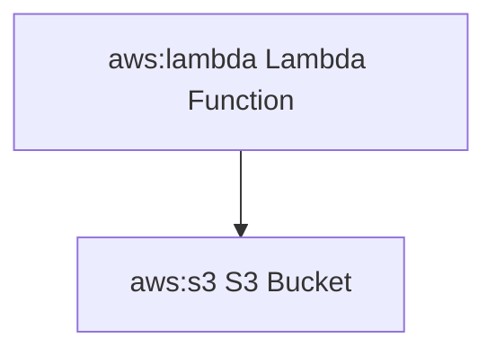

# Mermaid AWS Icons

A collection of AWS icons for use with Mermaid.js diagrams.

## Installation

```bash
npm install @codiva/aws-icons
```

## Usage

```javascript
import mermaid from 'mermaid';
import { icons } from '@codiva/aws-icons';

// Register the AWS icon pack
mermaid.registerIconPacks([
  {
    name: 'aws',
    icons,
  },
]);
```

Then in your Mermaid diagrams:



## Available Icons

All AWS service icons are available with the prefix `aws:`. For example, to use the Lambda icon, you would write `aws:lambda`.

Here's a complete list of available icons organized by category:

### Analytics
- aws:analytics-athena - Amazon Athena
- aws:analytics-clean-rooms - AWS Clean Rooms
- aws:analytics-cloudsearch - Amazon CloudSearch
- aws:analytics-data-exchange - AWS Data Exchange
- aws:analytics-data-pipeline - AWS Data Pipeline
- aws:analytics-datazone - AWS DataZone
- aws:analytics-emr - Amazon EMR
- aws:analytics-finspace - Amazon FinSpace
- aws:analytics-glue-databrew - AWS Glue DataBrew
- aws:analytics-glue-elastic-views - AWS Glue Elastic Views
- aws:analytics-glue - AWS Glue
- aws:analytics-kinesis-data-analytics - Amazon Kinesis Data Analytics
- aws:analytics-kinesis-data-streams - Amazon Kinesis Data Streams
- aws:analytics-kinesis-firehose - Amazon Kinesis Firehose
- aws:analytics-kinesis-video-streams - Amazon Kinesis Video Streams
- aws:analytics-kinesis - Amazon Kinesis
- aws:analytics-lake-formation - AWS Lake Formation
- aws:analytics-managed-streaming-for-apache-kafka - Amazon MSK
- aws:analytics-opensearch-service - Amazon OpenSearch Service
- aws:analytics-quicksight - Amazon QuickSight
- aws:analytics-redshift - Amazon Redshift

### Application Integration
- aws:app-integration-api-gateway - Amazon API Gateway
- aws:app-integration-appflow - Amazon AppFlow
- aws:app-integration-appsync - AWS AppSync
- aws:app-integration-console-mobile-application - AWS Console Mobile Application
- aws:app-integration-eventbridge - Amazon EventBridge
- aws:app-integration-express-workflows - AWS Express Workflows
- aws:app-integration-mq - Amazon MQ
- aws:app-integration-managed-workflows-for-apache-airflow - Amazon MWAA
- aws:app-integration-simple-notification-service - Amazon SNS
- aws:app-integration-simple-queue-service - Amazon SQS
- aws:app-integration-step-functions - AWS Step Functions

### Blockchain
- aws:blockchain-managed-blockchain - Amazon Managed Blockchain
- aws:blockchain-quantum-ledger-database - Amazon QLDB

### Business Applications
- aws:business-applications-alexa-for-business - Alexa for Business
- aws:business-applications-chime-sdk - Amazon Chime SDK
- aws:business-applications-chime-voice-connector - Amazon Chime Voice Connector
- aws:business-applications-chime - Amazon Chime
- aws:business-applications-connect - Amazon Connect
- aws:business-applications-honeycode - Amazon Honeycode
- aws:business-applications-pinpoint-apis - Amazon Pinpoint APIs
- aws:business-applications-pinpoint - Amazon Pinpoint
- aws:business-applications-simple-email-service - Amazon SES
- aws:business-applications-supply-chain - AWS Supply Chain
- aws:business-applications-wickr - AWS Wickr
- aws:business-applications-workdocs-sdk - Amazon WorkDocs SDK
- aws:business-applications-workdocs - Amazon WorkDocs
- aws:business-applications-workmail - Amazon WorkMail

### Cloud Financial Management
- aws:cloud-financial-management-application-cost-profiler - AWS Application Cost Profiler
- aws:cloud-financial-management-billing-conductor - AWS Billing Conductor
- aws:cloud-financial-management-budgets - AWS Budgets
- aws:cloud-financial-management-cost-and-usage-report - AWS Cost and Usage Report
- aws:cloud-financial-management-cost-explorer - AWS Cost Explorer
- aws:cloud-financial-management-reserved-instance-reporting - Reserved Instance Reporting
- aws:cloud-financial-management-savings-plans - Savings Plans

### Compute
- aws:compute-app-runner - AWS App Runner
- aws:compute-batch - AWS Batch
- aws:compute-ec2 - Amazon EC2
- aws:compute-elastic-beanstalk - AWS Elastic Beanstalk
- aws:compute-lambda - AWS Lambda
- aws:compute-lightsail - Amazon Lightsail
- aws:compute-outposts - AWS Outposts
- aws:compute-serverless-application-repository - AWS Serverless Application Repository
- aws:compute-wavelength - AWS Wavelength
- aws:compute-workspaces - Amazon WorkSpaces

### Containers
- aws:containers-app2container - AWS App2Container
- aws:containers-container-registry - Amazon Elastic Container Registry
- aws:containers-elastic-container-service - Amazon ECS
- aws:containers-elastic-kubernetes-service - Amazon EKS

### Database
- aws:database-aurora - Amazon Aurora
- aws:database-documentdb - Amazon DocumentDB
- aws:database-dynamodb - Amazon DynamoDB
- aws:database-elasticache - Amazon ElastiCache
- aws:database-keyspaces - Amazon Keyspaces
- aws:database-memorydb - Amazon MemoryDB for Redis
- aws:database-neptune - Amazon Neptune
- aws:database-rds - Amazon RDS
- aws:database-timestream - Amazon Timestream

### Developer Tools
- aws:developer-tools-cloud9 - AWS Cloud9
- aws:developer-tools-codeartifact - AWS CodeArtifact
- aws:developer-tools-codebuild - AWS CodeBuild
- aws:developer-tools-codecommit - AWS CodeCommit
- aws:developer-tools-codedeploy - AWS CodeDeploy
- aws:developer-tools-codepipeline - AWS CodePipeline
- aws:developer-tools-codestar - AWS CodeStar
- aws:developer-tools-command-line-interface - AWS CLI
- aws:developer-tools-tools-and-sdks - AWS Tools and SDKs
- aws:developer-tools-x-ray - AWS X-Ray

### End User Computing
- aws:end-user-computing-appstream - Amazon AppStream 2.0
- aws:end-user-computing-workspaces - Amazon WorkSpaces

### Front-End Web & Mobile
- aws:front-end-web-mobile-amplify - AWS Amplify
- aws:front-end-web-mobile-api-gateway - Amazon API Gateway
- aws:front-end-web-mobile-device-farm - AWS Device Farm
- aws:front-end-web-mobile-location-service - Amazon Location Service
- aws:front-end-web-mobile-pinpoint - Amazon Pinpoint

### Internet of Things
- aws:internet-of-things-core - AWS IoT Core
- aws:internet-of-things-device-defender - AWS IoT Device Defender
- aws:internet-of-things-device-management - AWS IoT Device Management
- aws:internet-of-things-events - AWS IoT Events
- aws:internet-of-things-greengrass - AWS IoT Greengrass
- aws:internet-of-things-sitewise - AWS IoT SiteWise
- aws:internet-of-things-things-graph - AWS IoT Things Graph

### Machine Learning
- aws:machine-learning-comprehend - Amazon Comprehend
- aws:machine-learning-forecast - Amazon Forecast
- aws:machine-learning-fraud-detector - Amazon Fraud Detector
- aws:machine-learning-kendra - Amazon Kendra
- aws:machine-learning-lex - Amazon Lex
- aws:machine-learning-personalize - Amazon Personalize
- aws:machine-learning-polly - Amazon Polly
- aws:machine-learning-rekognition - Amazon Rekognition
- aws:machine-learning-sagemaker - Amazon SageMaker
- aws:machine-learning-textract - Amazon Textract
- aws:machine-learning-transcribe - Amazon Transcribe
- aws:machine-learning-translate - Amazon Translate

### Management & Governance
- aws:management-governance-auto-scaling - AWS Auto Scaling
- aws:management-governance-cloudformation - AWS CloudFormation
- aws:management-governance-cloudtrail - AWS CloudTrail
- aws:management-governance-cloudwatch - Amazon CloudWatch
- aws:management-governance-config - AWS Config
- aws:management-governance-control-tower - AWS Control Tower
- aws:management-governance-license-manager - AWS License Manager
- aws:management-governance-organizations - AWS Organizations
- aws:management-governance-systems-manager - AWS Systems Manager
- aws:management-governance-trusted-advisor - AWS Trusted Advisor

### Media Services
- aws:media-services-elastic-transcoder - Amazon Elastic Transcoder
- aws:media-services-elemental-mediaconvert - AWS Elemental MediaConvert
- aws:media-services-elemental-medialive - AWS Elemental MediaLive
- aws:media-services-elemental-mediapackage - AWS Elemental MediaPackage
- aws:media-services-elemental-mediastore - AWS Elemental MediaStore
- aws:media-services-interactive-video-service - Amazon IVS

### Migration & Transfer
- aws:migration-transfer-application-discovery-service - AWS Application Discovery Service
- aws:migration-transfer-database-migration-service - AWS Database Migration Service
- aws:migration-transfer-datasync - AWS DataSync
- aws:migration-transfer-migration-hub - AWS Migration Hub
- aws:migration-transfer-server-migration-service - AWS Server Migration Service
- aws:migration-transfer-snowball - AWS Snowball
- aws:migration-transfer-transfer-family - AWS Transfer Family

### Networking & Content Delivery
- aws:networking-content-delivery-api-gateway - Amazon API Gateway
- aws:networking-content-delivery-cloudfront - Amazon CloudFront
- aws:networking-content-delivery-direct-connect - AWS Direct Connect
- aws:networking-content-delivery-global-accelerator - AWS Global Accelerator
- aws:networking-content-delivery-private-link - AWS PrivateLink
- aws:networking-content-delivery-route53 - Amazon Route 53
- aws:networking-content-delivery-vpc - Amazon VPC

### Security, Identity & Compliance
- aws:security-identity-compliance-certificate-manager - AWS Certificate Manager
- aws:security-identity-compliance-cognito - Amazon Cognito
- aws:security-identity-compliance-detective - Amazon Detective
- aws:security-identity-compliance-directory-service - AWS Directory Service
- aws:security-identity-compliance-firewall-manager - AWS Firewall Manager
- aws:security-identity-compliance-guardduty - Amazon GuardDuty
- aws:security-identity-compliance-iam - AWS IAM
- aws:security-identity-compliance-inspector - Amazon Inspector
- aws:security-identity-compliance-key-management-service - AWS KMS
- aws:security-identity-compliance-macie - Amazon Macie
- aws:security-identity-compliance-secrets-manager - AWS Secrets Manager
- aws:security-identity-compliance-security-hub - AWS Security Hub
- aws:security-identity-compliance-shield - AWS Shield
- aws:security-identity-compliance-waf - AWS WAF

### Storage
- aws:storage-backup - AWS Backup
- aws:storage-elastic-block-store - Amazon EBS
- aws:storage-elastic-file-system - Amazon EFS
- aws:storage-fsx - Amazon FSx
- aws:storage-s3-glacier - Amazon S3 Glacier
- aws:storage-s3 - Amazon S3
- aws:storage-storage-gateway - AWS Storage Gateway

## Contributing

Contributions are welcome! Please feel free to submit a Pull Request.

## License

This project is licensed under the MIT License.
## License

This project is licensed under the MIT License. AWS icons are trademarks of Amazon Web Services, Inc.
